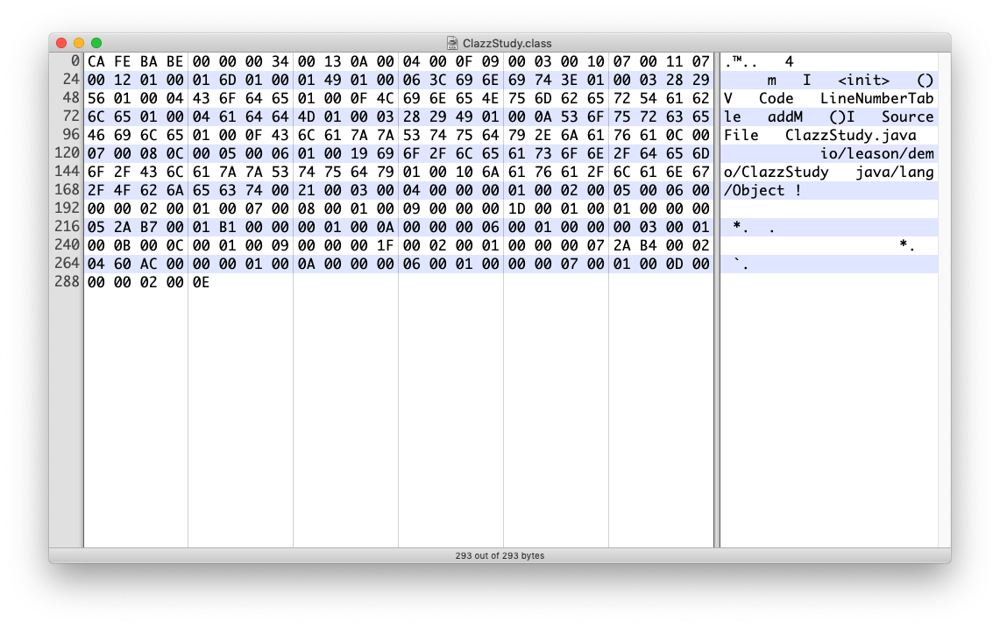

# 介绍

《深入理解java虚拟机》看第二遍了,还是有好多问题和知识点疏漏和不懂,最近对着书复习了一点class文件的结构,所以写一篇博客来说记录下.

这次解析的源代码文件比较简单,使用的是jdk1.8.0_191.

> .java文件源码

```java
package io.leason.demo;

public class ClazzStudy {
    private int m;

    public int addM() {
        return m + 1;
    }
}
```

> 编译之后的.class文件(javac编译器)

贴代码块效果太差了,直接上截图吧


# 解析

class文件是一组以单字节(8bit)为单位的二进制流,一个字节占2个16进制的空间,class文件采用类似C语言的伪结构体,这种结构包括两种数据类型:无符号数和表.

无符号数属于基本数据类型,我们采用`u1`、`u2`、`u4`,`u8`分别表示一个字节、两个字节、四个字节和八个字节的无符号数.

表是有多个无符号数和其它数据项组合成的,下面会有例子更清楚.

整个class文件由下面的数据项组成

|        类型        |         名称        |          数量         |
|:------------------:|:-------------------:|:---------------------:|
|         u4         |        magic        |           1           |
|         u2         |    minor_version    |           1           |
|         u2         |    major_version    |           1           |
|         u2         | constant_pool_count |           1           |
| constant_pool_info |    constant_pool    | constant_pool_count-1 |
|         u2         |     access_flags    |           1           |
|         u2         |      this_class     |           1           |
|         u2         |     super_class     |           1           |
|         u2         |   interfaces_count  |           1           |
|         u2         |      interfaces     |    interfaces_count   |
|         u2         |     fields_count    |           1           |
|     filed_info     |        fileds       |      field_count      |
|         u2         |    methods_count    |           1           |
|     method_info    |       methods       |     methods_count     |
|         u2         |   attributes_count  |           1           |
|   attribute_info   |      attribute      |    attributes_count   |

上面注意的一点就是接口并不是一个表结构,而是一个u2大小的数据表示,指向常量池对应索引的数据信息,其它的则是info结尾的表结构数据

上面的信息表示class文件的各个字节表示的数据都是明确的,没有填充对齐的字节,顺序和长度都是固定的,这种考虑是因为java语言最初是面向智能家电和网络的.

## magic

根据上表可知class文件的前4个字节表示的是magic,翻译为魔数,对应图上的`CA FE BA BE`4个字节,主要是用来表示这个文件是虚拟机识别的class文件.约定俗成,可以google其来源.

## monior_version 、major_version

魔数后面的两个u2数据分别是`0000`和`0034`,分别对应的二进制是 0 和 52,分别对应的是编译器JDK的次、主版本号,每个大版本发布都会在主版本号上+1,而JDK1.0使用的版本号是45,从而推算出我使用的JDK版本号是JDK8

## constant_pool

紧接版本号后面的是常量池信息,主要存放一些字面量和符号引用,字面量主要意思类似于我们定义的基本类型的final值,包括字符串一些.符号引用就是用来唯一确定类、接口、字段、方法一些名称和描述符(公私有等一些修饰符)的.

前两个字节表示的是常量池中的常量的个数,由于是2个字节,所以最大值为25535个.
图中对应的个数为`1 * 16 ^ 1 + 3 * 16 ^ 0 = 19`个常亮,而所有常量池默认第一个常量用来表示`没有任何引用的常亮`的意思,比如用来表示匿名内部类的名称的信息,所以后面接着的18个`constant_pool_info`类型的数据就是常量池中的常量信息.

### constat_pool_info

constant_pool_info是一种表结构数据,class文件中一般存在14种这种类型的结构数据,如下表

|               类型               | tag |           描述           |
|:--------------------------------:|:---:|:------------------------:|
|        CONSTANT_Utf8_info        |  1  |     UTF-8编码的字符串    |
|       CONSTANT_Integer_info      |  3  |        整型字面量        |
|        CONSTANT_Float_info       |  4  |       浮点型字面量       |
|        CONSTANT_Long_info        |  5  |       长整型字面量       |
|       CONSTANT_Double_info       |  6  |    双精度浮点型字面量    |
|        CONSTANT_Class_info       |  7  |   类或者接口的符号引用   |
|       CONSTANT_String_info       |  8  |     字符串类型字面量     |
|      CONSTANT_Fieldref_info      |  9  |      字段的符号引用      |
|      CONSTANT_Methodref_info     |  10 |    类中方法的符号引用    |
| CONSTANT_InterfaceMethodref_info |  11 |   接口中方法的符号引用   |
|     CONSTANT_NameAndType_info    |  12 | 字段或方法的部分符号引用 |
|    CONSTANT_MethodHandle_info    |  15 |       表示方法句柄       |
|     CONSTANT_MethodType_info     |  16 |       表示方法类型       |
|    CONSTANT_InvokeDynamic_info   |  18 | 表示识一个动态方法调用点 |

每个类型的constant_pool_info都有不同的数据结构类型,而共同点都是前1个字节表示的都是tag,所以可以根据tag对应的类型所占用的数据结构一一解析出来整个常量池.

#### 常量解析

1.紧跟着`0013`后面的第一个字节是`0A`,所以tag为10,对应表中的`CONSTANT_Methodref_info`,而这个类型的表数据结构为

|               项目               | 类型 |                        描述                       |
|:--------------------------------:|:----:|:-------------------------------------------------:|
|                tag               |  u1  |                       值为10                      |
|               index              |  u2  | 指向声明方法的类描述符CONSTANT_Class_info的索引项 |
|               index              |  u2  | 指向名称及类型描述符CONSTANT_NameAndType的索引项 |

所以对应的`CONSTANT_Class_info`的索引项为4,对应的`CONSTANT_NameAndType`的索引项为15,至此第一个常量解析完毕

---

2.同理第二个tag为9,对应表中的`CONSTANT_Fieldref_info`,表结构如下

|               项目               | 类型 |                        描述                       |
|:--------------------------------:|:----:|:-------------------------------------------------:|
|                tag               |  u1  |                       值为9                      |
|               index              |  u2  | 指向声明字段的类或者接口描述符CONSTANT_Class_info的索引项 |
|               index              |  u2  | 指向字段描述符CONSTANT_NameAndType的索引项 |

`CONSTANT_Class_info`: 3, `CONSTANT_NameAndType`: 16

---

3.tag3: 7 ==> `CONSTANT_Class_info`

|               项目               | 类型 |                       描述                       |
|:--------------------------------:|:----:|:------------------------------------------------:|
|                tag               |  u1  |                       值为8                      |
|               index              |  u2  |               指向全限定名常量索引               |

常量索引: 17

---

4.tag4: 7,所以同上,常量索引: 18

---

5.tag5: 1 ==> `CONSTANT_Utf8_info`

|               项目               | 类型 |               描述              |
|:--------------------------------:|:----:|:-------------------------------:|
|                tag               |  u1  |              值为1              |
|              length              |  u2  |  UTF-8编码的字符串占用的字节数  |
|               bytes              |  u1  | 长度为length的UTF-8编码的字符串 |

解析出来的字符串为`m`

---

6.tag6: 1, 同上, 字符串: `I`

---

7.tag7: 1, 字符长度为6个字节: `3C 69 6E 69 74 3E`, 对应字符串: `<init>`

---

8.tag8: 1, 字符串长度为3: `28 29 56`, 对应字符串: `()V`

--

9.tag9: 1, 字符长度为4: `43 6F 64 65`, 对应字符串: `Code`

--

10.tag10: 1, 字符串长度为15: `4C 69 6E 65 4E 75 6D 62 65 72 54 61 62 6C 65`, 对应字符串: `LineNumberTable`

---

11.tag11: 1, 字符串长度4: `61 64 64 4D`, 对应字符串: `addM`

---

12.tag12: 1, 字符串长度3: `28 29 49`, 对应字符串: `()I`

---

13.tag13: 1, 字符串长度10: `53 6F 75 72 63 65 46 69 6C 65`, 对应字符串: `SourceFile`

---

14.tag14: 1, 字符串长度15: `43 6C 61 7A 7A 53 74 75 64 79 2E 6A 61 76 61`, 对应字符串 `ClazzStudy.java`

---

15.tag15: 12 ==> `CONSTANT_NameAndType_info`, 表结构如下

|               项目               | 类型 |                 描述                 |
|:--------------------------------:|:----:|:------------------------------------:|
|                tag               |  u1  |                 值为1                |
|               index              |  u2  |   指向该字段或者方法名称常量的索引   |
|               index              |  u2  | 指向该字段或者方法描述符常量项的索引 |

第一个index: 7, 第二个index: 8

---

16.tag16: 12, 同上, 第一个index: 5, 第二个index: 6

---

17.tag17: 1, 字符串长度为25: `69 6F 2F 6C 65 61 73 6F 6E 2F 64 65 6D 6F 2F 43 6C 61 7A 7A 53 74 75 64 79`, 对应字符串: `io/leason/demo/ClazzStudy`

---

18.tag18: 1, 字符串长度16: `6A 61 76 61 2F 6C 61 6E 67 2D 4F 62 6A 65 63 74`, 对应字符串为: `java/lang/Object`

---

以上就是所有常量,其中字符串常量最多,先列出来:

| 索引 |            内容           |
|:----:|:-------------------------:|
| 5    | m                         |
| 6    | I                         |
| 7    |  \<init\>                     |
| 8    | ()V                       |
| 9    | Code                      |
| 10   | LineNumberTable           |
| 11   | addM                      |
| 12   | ()V                       |
| 13   | SourceFile                |
| 14   | ClazzStudy.java           |
| 17   | io/leason/demo/ClazzStudy |
| 18   | java/lang/Object          |

接着来索引项为1的`CONSTANT_Methodref_info`的`CONSTANT_Class_info`,对应的索引为4,而4的全限定类名常量索引为18:`java/lang/Object`,而全限定类名主要是包括包名在内的全名称一种表示形式,把.换成了/,所以表示是Object这个类型.接着解析对应的`CONSTANT_NameAndType`,索引为15,而15对应的方法名称常量字符串(索引为7)为`<init>`,描述符常量字符串(所因为8)为`()V`.整个常量的意思就是午餐的构造函数,返回值为Object(详细的下篇会讲到).

剩下来的还有索引为2、3、16,同样的方法可以解析出有个变量名为m的,类型为int(I)的属于io.leason.demo.ClazzStudy这个类的字段.关于这些I、()V等奇怪的字符串常量下篇会讲到,常量池的解析差不多就这么多了.
