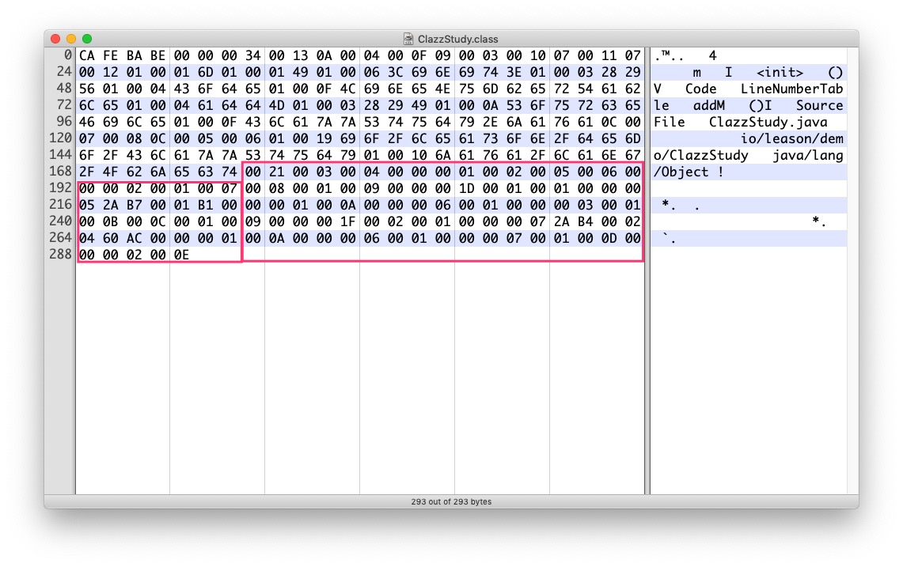

# 介绍

接着上节的解析结果,我们继续解析剩下的一些属性.

> .java文件源码

```java
package io.leason.demo;

public class ClazzStudy {
    private int m;

    public int addM() {
        return m + 1;
    }
}
```

> 编译之后的.class文件(javac编译器)

剩下的字节码我已经圈出来了



# 解析

## 1. 访问标志

常量池后面紧接着是该class文件类或接口的访问标志信息(两个字节),表示该类或者接口是否是public,final,abstract等,具体的含义如下

|    标志名称    | 标志值 | 含义                                                                                                                                                            |
|:--------------:|--------|-----------------------------------------------------------------------------------------------------------------------------------------------------------------|
| ACC_PUBLIC     | 0X0001 | 是否为public                                                                                                                                                    |
| ACC_FINAL      | 0X0010 | 是否有final修饰                                                                                                                                                 |
| ACC_SUPER      | 0X0020 | 是否允许使用invokespecial字节码指令的新语意, invokespecial指令的语意在JDK1.0.2发审过改变, 为了区别这条指令使用哪种语意,JDK1.0.2之后编译 出来的class文件该值为真 |
| ACC_INTERFACE  | 0X0200 | 是否是个接口                                                                                                                                                    |
| ACC_ABSTRACT   | 0X0400 | 是否是抽象的,接口也是抽象的                                                                                                                                     |
| ACC_SYNTHETIC  | 0X1000 | 表示不是用户代码产生的类                                                                                                                                        |
| ACC_ANNOTATION | 0X2000 | 表示是个注解                                                                                                                                                    |
| ACC_ENUM       | 0X4000 | 表示是个枚举类                                                                                                                                                  |

`00 21` = `0X0001` | `0X0020`,所以表示这个类是public的,因为用的是JDK1.8所以ACC_SUPER标志也为真,其它的接口标志什么的都为false.

## 2. 类索引、父类索引、接口索引集合

类索引占用u2结构空间,由于java是单继承的,所以父类索引也是用u2结构表示,而接口可以实现多个,所以用u2类型数据的集合(length:u2,value:length * u2).

可以解析出来的是类索引为0x0003,父类索引为0x0004,接口个数为0.

根据上节常量池的解析结果可知0x0003表示的是全限定类名为`io/leason/demo/ClazzStudy`的类索引,也能够理解.

父类对应的是全限定类名为`java/lang/Object`的类索引,跟我们所认知的所有类默认都是直接或间接继承于Object的是对应的.

## 3. 字段表集合

字段表表示声明在类或接口中的变量.修饰符一般都有访问修饰符如public、是否static、是否final、是否volatile、是否可序列化(transient)、字段名称等.有些修饰符可以用boolean值来表示,适合用标志位来表示.而名称一些属性则使用前面的常量池索引来表示.

字段表结构如下

|      类型      | 名称              | 数量            |
|:--------------:|-------------------|-----------------|
| u2             | access_flags      | 1               |
| u2             | name_index        | 1               |
| u2             | description_index | 1               |
| u2             | attribute_count   | 1               |
| attribute_info | attributes        | attribute_count |

access_flags标志位和含义如下

|    标志名称   | 标志值 | 含义               |
|:-------------:|--------|--------------------|
| ACC_PUBLIC    | 0X0001 | 是否public         |
| ACC_PRIVATE   | 0X0002 | 是否private        |
| ACC_PROTECTED | 0X0004 | 是否protected      |
| ACC_STATIC    | 0X0008 | 是否静态           |
| ACC_FINAL     | 0X0010 | 是否final          |
| ACC_VOLATILE  | 0X0040 | 是否volatile       |
| ACC_TRANSIENT | 0X0080 | 是否可序列化       |
| ACC_SYNTHETIC | 0X1000 | 是否编译器自动生成 |
| ACC_ENUM      | 0X4000 | 是否枚举类型       |

开头的`00 01`表示这个类只有一个字段.

根据图中可以看出access_flags为`00 02`,所以表示这是个public修饰的字段,不为static、final等.

name_index为`00 05`,对应常量池的字符串为`m`,`description_index`为`I`,那么`I`表示什么呢.

`I`表示字段的类型.一般如下表

| 标志字符 | 含义                           |
|:--------:|--------------------------------|
| B        | byte                           |
| C        | char                           |
| D        | double                         |
| F        | float                          |
| I        | int                            |
| J        | long                           |
| S        | short                          |
| Z        | boolean                        |
| V        | void                           |
| L        | 对象类型,例如Ljava/lang/String |

所以表明是个int类型的字段,后面的`attribute_count` = 0,这个属性一般用于字段的额外属性,例如static final类型的数据,就会有ConstantValue属性,指向常量池的部分信息.

所以上述表示的是`private int m;`这段代码.

### description_index

我们来说下这个`description_index`,翻译过来就是描述符索引,描述符适用于字段和方法,表示字段数据类型、方法的参数列表和返回值信息.
一般的字段类型描述符就如上表表示的一样,数组类型的字段则用`[`来表示,二维数组用两个`[`表示,比如`String[] a`则对应的描述符为`[Ljava/lang/String`.

用来描述方法时,按照 `(参数列表)返回值` 形式来表示, 例如`char[] toCharArray(String a)`的描述符为`(Ljava/lang/String)V`.

## 4.方法表集合